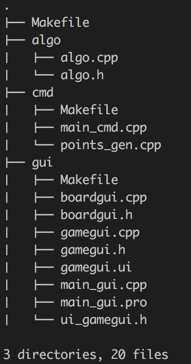

开发平台
------------
* 平台: Max OS X 10.11.2
* 编译器: clang++: Apple LLVM version 7.0.2 (clang-700.1.81)

依赖库、工具版本
------------
* Qt=4.8.7
* qmake=2.01a

工程结构
------------


* `algo` 子目录: 基础数据结构定义; 算法; 文件操作工具; 随机生成工具;
* `cmd` 子目录: 命令行接口
* `gui` 子目录: 图形界面接口

构建
------------
在p1目录下运行:
```bash
make
```
构建成功将生成 `build_gui` 和 `build_cmd` 两个目录, 目录下分别是平台的图形界面和命令行可执行文件.

运行 ``make clean`` 可以清除之前构建产生的文件。

运行
------------
### Mac OS X

```bash
./build_gui/debug/main_gui.app/Contents/MacOS/main_gui
```
