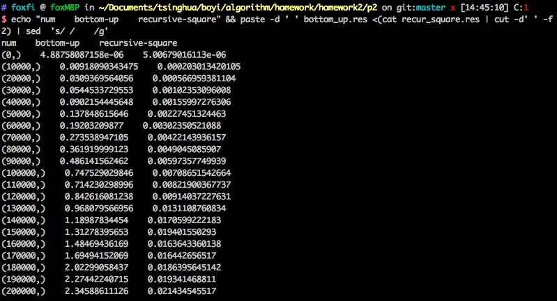

Problem 2: 斐波那契数列解法对比
================

开发平台
------------
* 平台: Max OS X 10.11.2
* Python: 2.7.10

运行
------------
比如从0开始到1000000, 每100000数进行计算, 而且每次运算重复2次(默认重复3次计算取平均), 并计时:

```
FIBO_REPEATS=2 FIBO_START=0 FIBO_STEP=10000 FIBO_END=200000 ./test.sh
```

结果将存在 ``bottom_up.res`` 和 ``recur_square.res`` 文件中。

查看结果, 可以在该目录下运行:

```
echo "num    bottom-up    recursive-square" && paste -d ' ' bottom_up.res <(cat recur_square.res | cut -d' ' -f2) | sed  's/ /    /g'
```



分析
------------
理论分析:

1. 自底向上法计算的复杂度为$$O(n)$$

2. 递归矩阵乘法的复杂度的通项公式为
$$T(n) = 2T(n/2) + O(1)$$
 由主定理可得理论复杂度为$$O(lg(n))$$
 
 
下图是针对5次重复实验，从0 ~ 400000, 每10000为一步的实验结果:

->  <-


为了下图是针对2次重复实验, 从0 ~ 1000000, 每20000为一步的实验结果(由于重复实验次数少和我同时在使用自己的电脑, 有一些点比较不准确)

-><-

从上面两个实验结果中可以看出, 两种算法运行时间差距随着N增长越来越大。且可以看出自底向上算法的时间复杂度大致为O(n)。由于主机计算能力的限制, 在1000000的实验处还并不能看出递归矩阵乘法算法的渐进复杂度为O(lg(n))。

<!--
|   N   | bottom-up打表  |  递归矩阵乘   |
|  :-:  |:-------------:|:------------:|
|0      |0.00000489     |0.00000501
|10000  |0.00918        |0.000203
|20000  |0.0309         |0.000567
|30000  |0.0545         |0.00102
|40000  |0.0902         |0.00160
|50000  |0.138          |0.00227
|60000  |0.192          |0.00302
|70000  |0.274          |0.00422
|80000  |0.362          |0.00490
|90000  |0.486          |0.00597
|100000 |0.748          |0.00709
|110000 |0.714          |0.00822
|120000 |0.843          |0.00914
|130000 |0.968          |0.0131
|140000 |1.19           |0.0171
|150000 |1.31           |0.0194
|160000 |1.49           |0.0164
|170000 |1.70           |0.0164
|180000 |2.02           |0.0186
|190000 |2.27           |0.0193
|200000 |2.35           |0.0214


-->