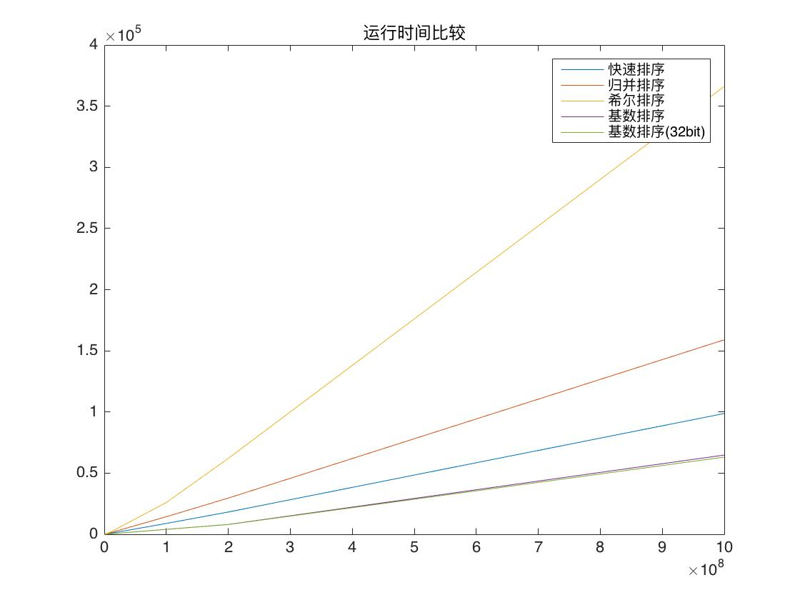
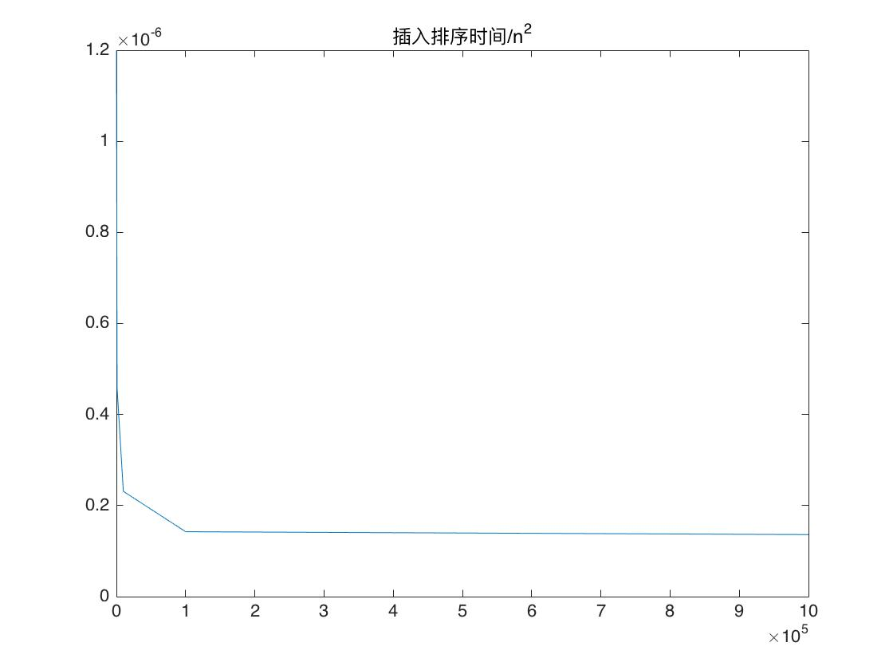
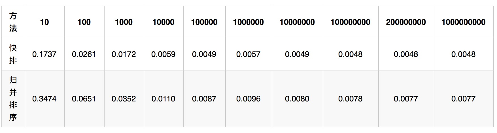
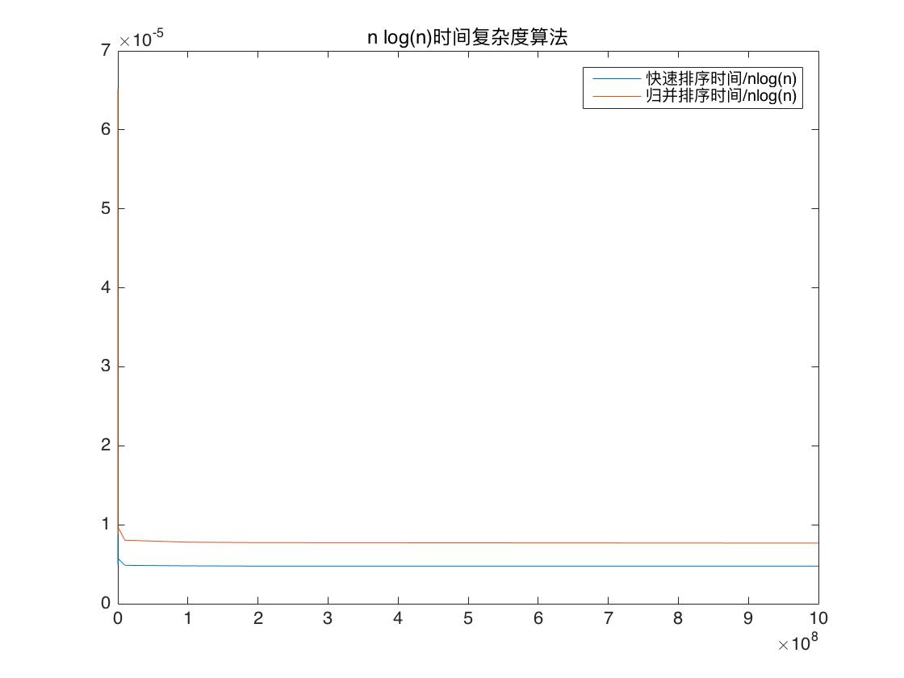

整数排序比较
========
开发平台
--------
* 平台: Mac OS X 10.11.2
* 编译器: ``clang++``: Apple LLVM version 7.0.2 (clang-700.1.81)

分析
--------
本次作业实现了几种排序算法，并对比了这几种排序算法在对较大范围内的非负整数进行排序时的效果。
下面先理论分析:

* **插入排序**: 复杂度为$$\Theta(n^2)$$

* **快速排序**: 复杂度为$$\Theta(n\log(n))$$

* **归并排序**: 复杂度为$$\Theta(n\log(n))$$

* **希尔排序**: 在我的实现中使用的步长序列是$$\frac{n}{2}, \frac{n}{4}, \dots, 1$$
  根据维基百科上的资料，这个步长选取得到的平均时间复杂度为$$\Theta(n\sqrt{n})$$

* **基数排序**: 我实现了两个有细微差别的版本; 其中一个先用O(n)的时间找到了所有数字里面的最大值, 用该值计算了最少需要多少比特位可以表达所有数字, 用于决定需要多少次计数排序的pass; 另一个版本则认为每个数字都为32bit的无符号整型，不需要一开始的O(n)时间。

   由于在n很大的时候, 有极大可能性需要接近32bit才能表达所有数字, 第一种方法的一个O(n)的时间是浪费的, 所以会比第二种方法略微慢一点点。但是总的来说这两种方法差别不大。
   
   为了保证计数排序的复杂度仍然保持在O(n), 我们需要选择$$r=\log{n}$$理论上来说, 基数排序的时间复杂度为$$\Theta(n)$$ 而不是$$\Theta(n/\log{n})$$因为不管n多大, 都至少需要一次计数排序, 即$$T = o(n)$$且$$T < 32 * T(计数排序) \implies T = O(n) \implies T=\Theta(n)$$。

* **随机生成0~2^32-1范围内均匀分布的整数的方法**:
由于RAND_MAX < 2^32 - 1, 不能简单的用$$\lfloor\frac{rand()}{\mbox{RAND_MAX}} * max \rfloor$$来计算，这样有很多数字根本无法取到，并不是均匀分布。为了生成一个大整数范围的均匀随机分布，可以借鉴基数排序的思想，将要生成的整数分为几个比特段, 分别使用``rand()``生成每个段的数字, 然后进行位运算构成最后的随机整数。


构建和运行
--------
构建: 在p3目录下运行:

```
make
```

运行: 在p3目录下运行:

```
make test
```

test结果将被打印到标准输出和`result.txt`文件中。

实验与分析
--------
测试环境:

* CPU: Intel Core i7-6900K@3.20GHz
* 操作系统: Ubuntu 14.04.5 LTS
* 编译器: g++ 4.8.4
* 编译优化参数: ``-O2``
* L1: 512KB; L2: 2048kB


下表是运行3次，得到的平均插入排序、快速排序、归并排序、希尔排序、基数排序的时间结果:

| 输入数据量 | 插入排序 | 快速排序 | 归并排序 | 希尔排序 | 基数排序 | 基数排序(32bit) |
| :-------: |  :------:  | :----: | :---: | :---: | :---: | :---: |
|   10 | 0.008 | 0.004 | 0.008 | 0.004 | 0.023 | 0.007 |
| 100  | 0.012 | 0.012 | 0.03 | 0.014 | 0.025 | 0.013 |
| 1000 | 0.458 | 0.119 | 0.243 |  0.162 | 0.064 | 0.046 |
| 10000 | 22.126 | 0.545 | 1.011 | 0.882 | 0.242 | 0.213 |
| 100000 | 1425.88 | 5.605 | 10.056 | 10.286 | 3.719 | 3.677 | 
| 1000000 |  136197 | 78.34 | 132.096 | 154.42 | 38.863 | 38.802 |
| 10000000 |  | 784.562 |  1296.38 | 1773.11 |  398.623 | 368.645 |
| 100000000 | | 8845.2 | 14356.7 | 25994.5 | 4027.18 | 3967.67 |
| 200000000 | | 18207.9 | 29589.2 | 62009.6 | 8044.77 | 7968.52 |
| 1000000000 | | 98754 | 158989 | 366113 | 64774.8 | 63103.3 |

插入排序在n较小的时候比较快，但是随着n的增加，可以看出插入排序的时间开始成平方上升。渐进复杂度为O(n^2)。由于插入排序在大数据量时太慢，所以不在大数据量和其他的算法一起对比。

为了直观地看出几种排序的快慢, 对几种算法的运行时间绘图如下:

->  <-

从表格中的结果可以看出: 在纯整数的排序上, 有着较优渐进时间复杂度的基数排序确实比其他排序更快。其它几种非平方复杂度排序中, 快速排序由于缓存友好, 速度最快, 其次是复杂度同样的归并排序; 希尔排序复杂度比这两者高(见前面理论分析), 相对更慢。

插入排序的复杂度为$$\Theta(n^2)$$实验结果较好的印证了这一点, 下图是插入排序时间比上n平方的值:

->  <-

快速排序和归并排序复杂度为$$\Theta(n\log{n})$$实验结果较好的印证了这一点, 下表和图是快速排序和归并排序的时间比上nlog(n)的值:

<!-- | 方法 | 10 | 100 | 1000 | 10000 | 100000 | 1000000 | 10000000 | 100000000 | 200000000 | 1000000000 |
| :---: | :---: | :---: | :---: | :---: | :---: | :---: | :---: | :---: | :---: | :---: 
| 快排 | 0.1737  |  0.0261  |  0.0172   | 0.0059  |  0.0049  |  0.0057 |   0.0049|    0.0048  |  0.0048  |  0.0048|
| 归并排序 |   0.3474 |   0.0651  |  0.0352  |  0.0110  |  0.0087  |  0.0096    |0.0080 |   0.0078   | 0.0077   | 0.0077 | -->
->  <-
    
->  <-


